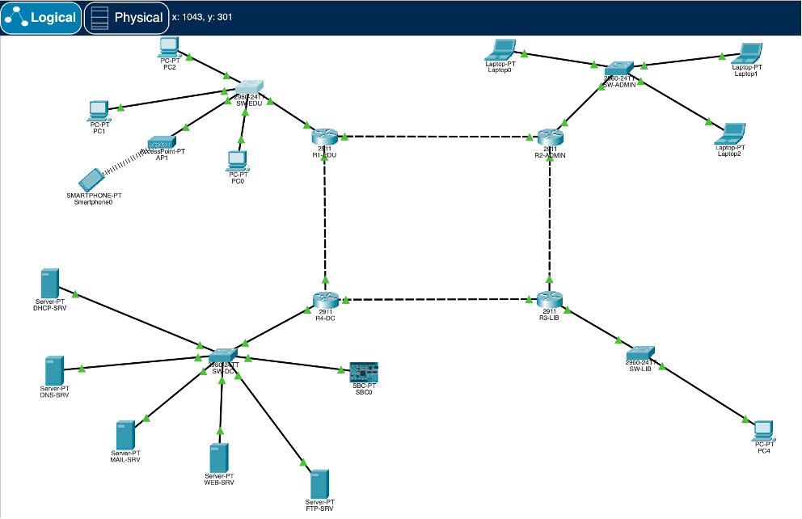
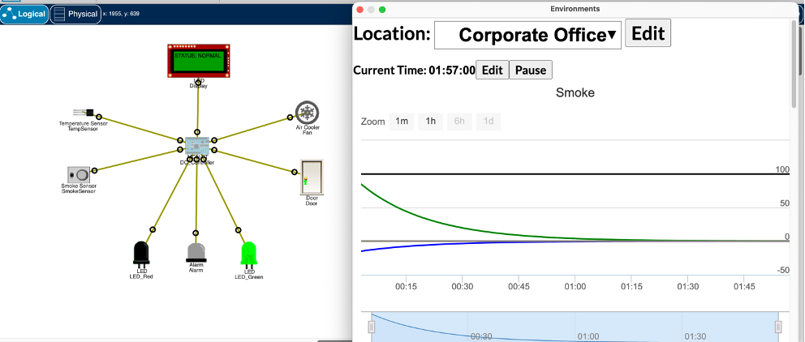
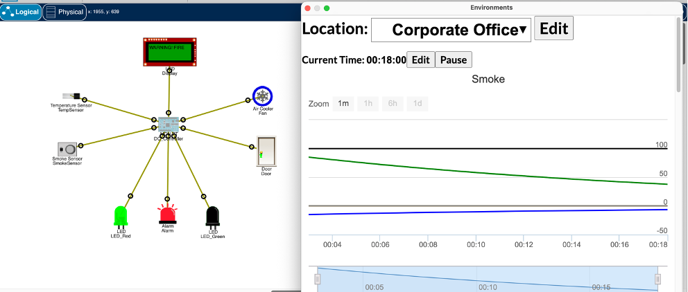
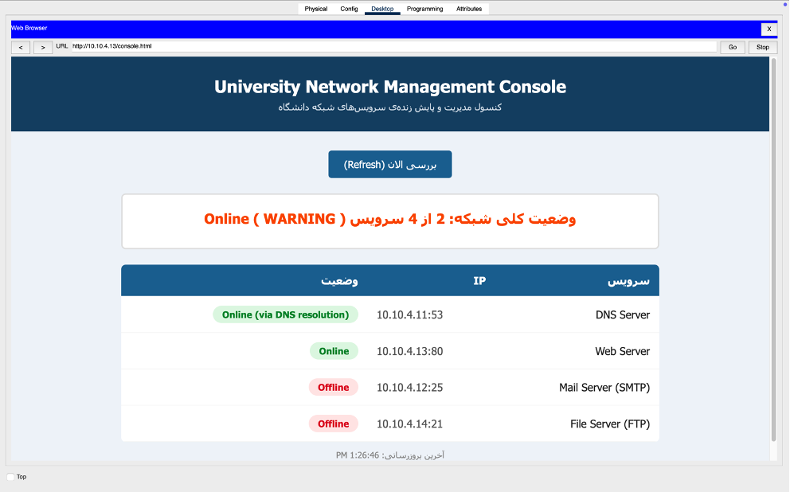
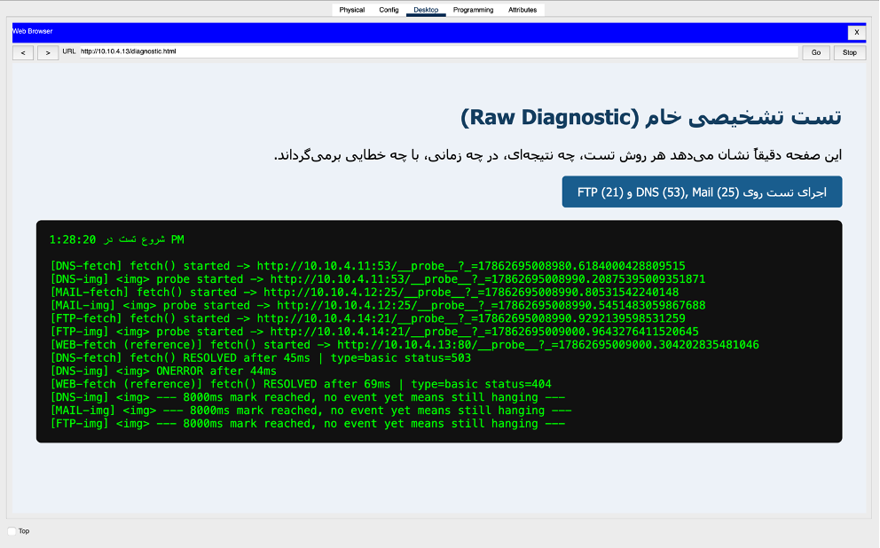

# Smart Campus Network Simulation 🎓🌐


A complete, multi-building Smart Campus network architecture simulated in Cisco Packet Tracer, augmented with a custom Python-based Network Diagnostic Console.

This project was originally developed as a comprehensive final project for the Computer Networks course at Shahid Beheshti University. It demonstrates the practical application of dynamic routing protocols, centralized network services, automated IP allocation, and IoT environmental monitoring within a campus environment.

## 🌟 Key Features

- **Robust Network Topology:** A ring topology connecting four main sectors (Educational, Administrative, Library, and Data Center) ensuring high availability.
- **Dynamic Routing:** OSPF (Open Shortest Path First) is configured across all routers for fast convergence and failover in case of a link failure.
- **Centralized Services:** A dedicated Data Center hosting DHCP (with Relay Agents), DNS, Web, FTP, and Mail servers.
- **IoT Integration:** Smart environmental monitoring circuits simulating normal conditions and danger/alert states.
- **Python Diagnostic Console:** A custom network management script (`console.py`) utilizing socket programming to actively monitor the health and uptime of campus services.
- **HTML Console:** A web-based interface for managing and viewing IoT and network status.

---

## 📸 Project Screenshots

### 1. Overall Network Architecture

The complete topology showing all interconnected buildings, routers (in a ring), switches, and end devices.


### 2. IoT Circuit - Normal State

The environmental monitoring system operating under safe, baseline conditions.


### 3. IoT Circuit - Danger State

The IoT system triggering alerts and automated responses during a simulated hazardous condition.


### 4. HTML Dashboard

The web interface used to monitor campus parameters and network service status.


### 5. Python Diagnostic Console

The terminal output of the custom Python script actively testing TCP connections to DNS, Web, Mail, and FTP servers.


---

## ⚙️ Architecture & Configurations

- **IP Addressing:**
  - Point-to-Point Router Links: `/30` subnets.
  - Local Area Networks (LANs): `/24` subnets (e.g., `10.10.1.0/24`).
- **Routing:** OSPF Area 0 is used globally. Passive interfaces are enabled on LAN-facing router ports to optimize bandwidth and security.
- **DHCP Relay:** The `ip helper-address` command is utilized on routers to forward broadcast DHCP requests from individual buildings to the centralized DHCP server in the Data Center.

## 🚀 How to Run the Project

### Prerequisites

- **Cisco Packet Tracer** (Version 8.0 or higher recommended)
- **Python 3.x** (For running the diagnostic console)

### Launching the Simulation

1. Clone this repository:
   ```bash
   git clone [https://github.com/yourusername/Smart-Campus-Network-Simulation.git](https://github.com/yourusername/Smart-Campus-Network-Simulation.git)
   ```
